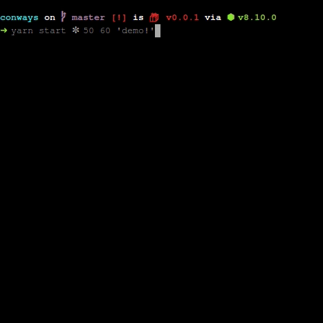

# Conway's Game of Life

An early, test-driven implementation of Conway's Game of Life, created as part of Enspiral Dev Academy week 2.

After cloning down and running `yarn`, start a default game with `yarn start`.

To customise the board, certain parameters can be altered in the start command in this order:

1. Live cell symbol - pass in any symbol (in single quotes ' ') or type `ok` to use the default symbol: ✼.

2. Size of the board (default 60)

3. Refresh speed (default 80ms)

4. For a small word-based board, type in a string of up to 5 letters or exclamation marks!

i.e. `yarn start '*' 50 100 'hiya!'` or `yarn start ok 30 20` 

### Demo

## Todo

Still a work in progress, the next steps would be improving / beautifying the word and letter functionality, refactoring code, and attempting to rewrite the game without quite so many for loops, if any! 